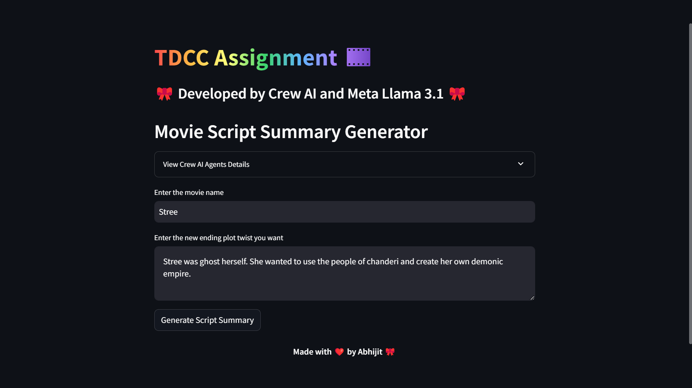

# Movie-Script-Summarizer-with-AI-Agents
Movie Script Summarizer using CrewAI Agents and Meta Llama 3.1 70B

## Agents Description

        <strong>🤖 Plot Designer</strong> 
        Plans an engaging and altered plot structure for the movie, seamlessly integrating the new ending while preserving key elements from the original storyline.
          
        <strong>🤖 Character Analyst</strong> 
        Analyzes the evolution of the main characters, focusing on how they adapt and change within the context of the new storyline and conclusion.
          
        <strong>🤖 Setting Designer</strong> 
        Describes how the settings and locations are influenced by the story’s shift, merging old and new elements to create a dynamic atmosphere.
          
        <strong>🤖 Theme Analyst</strong> 
        Evaluates the core themes of the movie, identifying how the new ending reshapes or introduces concepts such as power, control, and the intersection of past and future.
          
        <strong>🤖 Script Summarizer</strong> 
        Compiles a comprehensive story summary, ensuring all plot, character, setting, and thematic changes are cohesively presented.
    

